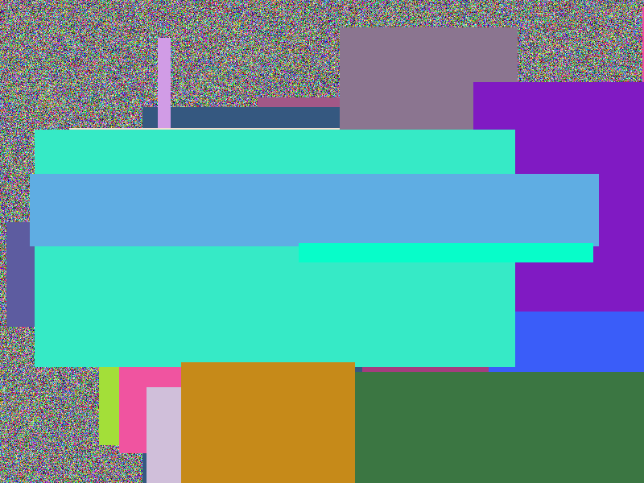
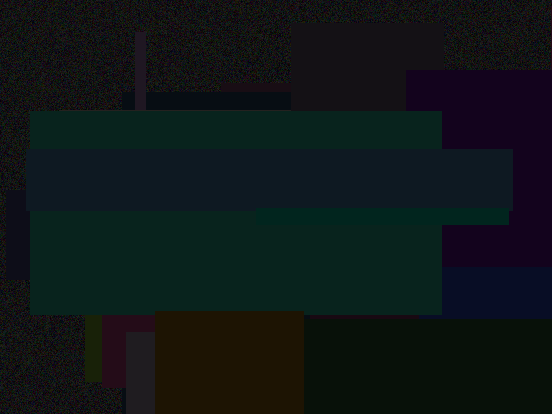

# photo-sift · 约拍照片自动筛选助手

> 自动把一整个文件夹的约拍照片，筛成 `保留` / `剔除（模糊）` / `剔除（闭眼）` / `剔除（曝光）` 四个分类，
> 并给出**每张照片的中文理由**。核心判断 = 传统计算机视觉 + 深度学习人脸关键点；边界照片交给
> **RAG + Prompt + Function Calling** 的大模型 Agent 复核。手写纯 Python，零 LangChain 黑盒。

约拍/陪拍拍完几百张照片，不想一张张整理？把这个工具指向照片文件夹，它会：

- 🧹 自动挑出 **闭眼、模糊、曝光不对** 的照片，只留好片
- 📋 每张照片附 **特征数值 + 中文判定理由**，生成可视化的 HTML 报告
- 👀 报告支持 **点击缩略图放大原图**，每张卡片有 **👍 保留 / 🗑 删除** 按钮，点了会真正移动文件
- 🔒 **绝不改动原文件夹**：只在输出目录里复制/移动，原图 100% 保留

---

## 目录

- [为什么做这个](#为什么做这个)
- [两阶段架构](#两阶段架构)
- [RAG 和 Prompt 是什么（大白话版）](#rag-和-prompt-是什么大白话版)
- [几个关键设计决策](#几个关键设计决策)
- [技术栈](#技术栈)
- [快速开始](#快速开始)
- [真实效果](#真实效果)
- [项目结构](#项目结构)
- [常见问题](#常见问题)

---

## 为什么做这个

约拍陪拍出片量很大（一次 300+ 张），其中相当一部分是废片：闭眼、没对上焦、曝光不对。
人工一张张筛很累，而筛选标准其实很机械——这正是程序擅长的。

但"筛"这件事没那么简单：

- **模糊**和**浅景深**看起来都是"糊"，但一个是废片、一个是好照片（背景虚化、人脸清晰）
- **闭眼**和**低眉笑**（古风/汉服常见的含蓄表情）在几何特征上几乎重叠
- **过曝**要区分"人脸过曝"和"背景高光"（蓝天、白衣不算人脸过曝）

所以本工具采用**两阶段**设计：CV 处理机械的部分，大模型处理需要"审美判断"的部分。

## 两阶段架构

```
              ┌────────────────────────────────────────────┐
              │            原始照片文件夹                    │
              └─────────────────────┬──────────────────────┘
                                    ▼
   ┌─────────────────────────────────────────────────────────────────┐
   │ 阶段1 · CV 预检（每张秒级，无网络，总是运行）                        │
   │   • 闭眼   MediaPipe Face Mesh 478 点 → EAR 眼纵横比              │
   │   • 模糊   Laplacian 方差（清晰度经典指标）                         │
   │   • 曝光   亮度直方图 + 死白/死黑裁剪比例 + 人脸区亮度                │
   │   输出：每张照片结构化特征 {faces, ear, sharpness, exposure}       │
   └─────────────────────┬───────────────────────────────────────────┘
                         ▼
     硬性废片直接归类       边界照片（信号矛盾）交给 Agent
   （严重模糊/全黑全白）       （浅景深？低眉笑？轻微欠曝？）
                         ▼
   ┌─────────────────────────────────────────────────────────────────┐
   │ 阶段2 · Agent + RAG + Function Calling（DeepSeek）                │
   │   1. RAG 检索：从摄影评判标准知识库检索最相关的段落                  │
   │   2. 拼 Prompt：角色 + 检索资料 + 照片特征 → 模型判断               │
   │   3. Function Calling：模型可自主调用 assess_blur /                 │
   │      assess_exposure / detect_eyes 复核，再下结论                  │
   │   输出：{keep, category, reason} 每张照片的中文理由                 │
   └─────────────────────┬───────────────────────────────────────────┘
                         ▼
   ┌─────────────────────────────────────────────────────────────────┐
   │ 结果目录   keep/ · reject_blur/ · reject_closed_eyes/ ·           │
   │            reject_exposure/                                      │
   │ 报告       report.md（Markdown）+ report.html（交互式可视化）       │
   └─────────────────────────────────────────────────────────────────┘
```

**为什么 CV 先筛、LLM 只处理边界照片？**
因为"严重模糊 / 全黑全白 / 两眼闭"这类硬性废片，CV 用几个阈值就能 100% 确定，没必要花 token 请大模型。
只有**信号矛盾**的照片（比如"整图偏糊但有人脸——可能是浅景深"，或"EAR 偏低——可能是低眉笑"）
才值得大模型结合知识库和工具复核。这样既快又省，也符合真实工程里"能用规则就用规则、规则解决不了再上模型"的原则。

## RAG 和 Prompt 是什么（大白话版）

这两个词是 AI 应用岗面试的常客，本仓库是真用、不是堆名词：

### Prompt（提示词）
大模型不是 if-else 程序，它是"靠读文字理解任务"的。给它的一段文字指令就叫 **prompt**。

本项目的 prompt 分两层：

- **System prompt**（`photosift/agent/prompts.py`）——定角色和规矩：
  > "你是专业的约拍照片筛选助手…… 明显闭眼、严重模糊、严重曝光错误 → 剔除；
  > 艺术性判断（氛围暗调、逆光剪影）→ 倾向保留…… 输出契约：必须输出 JSON `{"keep":…}`"

  把"输出必须是 JSON、不能乱说话"写进系统提示词，模型行为就稳定、可程序解析。
- **User prompt**（动态拼接）——每次判断前拼好：
  ```
  【检索到的摄影评判标准（请优先依据）】…… RAG 检索来的段落
  【计算机视觉预检特征（JSON）】…… {faces, blur, exposure, …}
  请判断照片「IMG_1234.jpg」是否保留，输出 JSON。
  ```

### RAG（检索增强生成）
大模型只学过大面上的知识，**不知道你这份专属资料**（比如"低眉笑要保留""人像以人脸曝光为准"）。
RAG = 把这些专属资料写进一个文档 → 切成小块建索引 → 每次提问时**先检索最相关的几块** →
把检索结果连同问题一起发给模型，它"带着资料"回答，有据可查、不瞎编。

本项目的 RAG（全部手写，`photosift/rag/`）：

1. **知识库**：`knowledge/photography_criteria.md`，8 个章节（模糊标准 / 曝光标准 / 闭眼边界 / 哪些该保留 / 人像曝光 / 组图一致性 / 修片能救回…）
2. **切块**：按 `##` 标题把文档切成若干个 chunk（`knowledge_base.py`）
3. **检索**：**手写 BM25 打分**（`retriever.py`），中文用"二元组 + 单字"分词。BM25 是 70 年代的经典
   TF-IDF 改进算法，几十行代码，公式写在代码注释里，面试能手推：
   ```
   score(d, q) = Σ IDF(t) · f(t,d)(k1+1) / (f(t,d) + k1·(1 − b + b·|d|/avgdl))
   ```
4. **拼接**：把 Top-3 命中段落拼进 user prompt

模型判断"这张照片该不该留"时，是**真的带着"修片能救回""低眉笑别删"这些资料**去回答的。

### Function Calling（工具调用）
让大模型**自己决定要不要调用工具**复核。模型的工具箱里有 `assess_blur`、`assess_exposure`、
`detect_eyes` 三个函数（OpenAI 标准 schema，`agent/tools.py`）。它如果对某个特征不放心，
会先调工具拿到真实数值，再下结论——这就是 **Agent**（能自主行动的大模型应用）的核心形态。

## 几个关键设计决策

| 问题 | 决策 | 为什么 |
|---|---|---|
| 闭眼 vs 低眉笑 | EAR 偏低**一律降级人工复核**，不自动删 | 真闭眼 EAR≈0.15 以下，低眉笑 EAR≈0.15~0.19，两者重叠、阈值分不开。宁可不误删一张好照片，让用户在报告里点一下 |
| 模糊 vs 浅景深 | 整图偏糊但**有人脸** → 交 Agent 复核人脸清晰度 | 背景虚化 + 人脸清晰是好照片，不能按"整图模糊"删 |
| 过曝 | 人像**以人脸亮度为准**，背景高光/白衣不算过曝 | 户外拍的蓝天、白色汉服很容易触发"死白比例"，但人脸曝光正常就是好片 |
| 谁来做最终决定 | **人** | 报告里每张卡片都有保留/删除按钮，点了真移动文件。系统是助理，不是裁判 |

## 技术栈

| 部分 | 方案 | 说明 |
|---|---|---|
| 人脸关键点 / 闭眼 | **MediaPipe Face Mesh**（深度学习模型）→ EAR 眼纵横比 | 478 点人脸关键点；模型首次运行自动下载（约 3.5MB）。装不上自动回退 OpenCV Haar 级联 |
| 模糊 | **Laplacian 方差** | 经典清晰度指标，可解释，无模型依赖 |
| 曝光 | **HSV 亮度 + 死白/死黑比例 + 人脸区亮度** | 人像曝光优先 |
| 大模型 | **DeepSeek API**（`deepseek-chat`） | 已有 key、成本低；OpenAI SDK 兼容 |
| RAG | **手写 BM25**（Okapi，k1=1.5, b=0.75） | 零依赖，纯 Python |
| 交互报告 | Python `http.server` + 原生 JS | 无前端框架 |

依赖只有 5 个：`opencv-python`、`mediapipe`、`openai`、`python-dotenv`、`numpy`。不拖 torch。

## 快速开始

```bash
# 1. 克隆并安装
git clone https://github.com/<你的用户名>/photo-sift.git
cd photo-sift
pip install -r requirements.txt

# 2. 配置 DeepSeek key（Agent 复核需要，.env 不会被提交）
cp .env.example .env    # 然后编辑 .env，填入 DEEPSEEK_API_KEY
```

用仓库自带的**合成测试图**快速试（不用联网下模型，纯 CV，几秒钟）：

```bash
python -m photosift.cli test_images --no-llm
# 输出到 test_images_sifted/，打开 report.md 看每张的理由
```

筛选真实照片（默认开 Agent 复核，需 .env 里的 key）：

```bash
python -m photosift.cli E:\我的约拍\2026.6.28_西山公园 --serve
```

参数说明：

| 参数 | 作用 |
|---|---|
| `--no-llm` | 只用 CV，不调大模型（离线可用） |
| `--limit N` | 只处理前 N 张（测试用） |
| `--serve` | 筛选完启动本地复核服务器 `http://127.0.0.1:8765`，支持报告里的保留/删除按钮 |
| `--port` | 改复核服务器端口 |
| `--out` | 指定输出目录（默认 `<照片目录>_sifted`） |

**--serve 模式**下，浏览器打开报告后：

- 点击缩略图 → 页内放大**原图**
- 点卡片上的 **👍 保留 / 🗑 删除** → 文件真的被移动到对应分类目录，刷新后状态保持

> 原文件夹从始至终只读。输出目录里放的是分类副本。

## 真实效果

先看合成测试图上的直观演示（仓库自带 `test_images/`，纯 CV 模式即可复现）：

| 原图 | 系统判定 |
|---|---|
|  | `keep` · 清晰、曝光正常 |
|  | `reject_blur` · 照片模糊（清晰度不足） |
|  | `reject_exposure` · 曝光过度/不足 |
|  | `llm` · 信号矛盾，待 Agent 复核（宁可不误删） |

在真实约拍照片上验证（忠山公园外拍，古风/人像混合）：

- **50 张照片**：CV + Agent 一键筛完，**49 张保留、1 张判为模糊**；其余全部分类清晰、理由可读
- 一组真实反馈驱动的修复：
  1. 早期把"背景高光"误判为过曝 → 改为**人脸曝光优先**，误删清零
  2. 早期把"背景虚化"误判为模糊 → 有人脸时降级给 Agent 复核浅景深
  3. 早期把**低眉笑**误判为闭眼 → 用户确认后改为"EAR 偏低一律人工复核"，好照片不再被误删
  4. 一张用户喜欢的**轻微模糊**照片，本来会被删——现在用户在报告里点一下 👍 保留即可

这套"边用边改 + 人做最终决定"的流程，正好是真实的 AI 应用工程迭代方式。

## 项目结构

```
photo-sift/
├── README.md                    # 本文档
├── requirements.txt             # 依赖（5 个）
├── .env.example                 # 配置模板（真实 .env 已 gitignore）
├── knowledge/
│   └── photography_criteria.md  # RAG 知识库（8 个章节，即检索的数据源）
├── test_images/                 # 合成测试图（清晰/模糊/过曝/欠曝/人脸）
├── photosift/
│   ├── cli.py                   # 命令行入口
│   ├── features.py              # 阶段1 特征提取 + 硬规则判定
│   ├── visual_report.py         # 交互式 HTML 报告
│   ├── review_server.py         # 本地复核服务器（保留/删除按钮 + 原图）
│   ├── report.py                # report.md + verdicts.json
│   ├── screen/
│   │   ├── eyes.py              # MediaPipe EAR 闭眼检测（Haar 兜底）
│   │   ├── blur.py              # Laplacian 方差
│   │   └── exposure.py          # 亮度直方图 + 人脸曝光优先
│   ├── rag/
│   │   ├── knowledge_base.py    # 知识库切块
│   │   └── retriever.py         # 手写 BM25 检索
│   └── agent/
│       ├── prompts.py           # system + user prompt 模板
│       ├── tools.py             # Function Calling 工具定义
│       └── agent.py             # DeepSeek + 工具循环 + RAG 拼装
└── examples/                    # 效果图（真实客人照片默认不入库）
```

## 常见问题

**Q：会动我原来的照片吗？**
不会。原文件夹只读，程序只在输出目录（`<照片目录>_sifted/`）里复制、移动分类副本。

**Q：必须联网吗？**
纯 CV 模式（`--no-llm`）完全离线。Agent 复核模式需要 DeepSeek API（首次运行还会下载人脸模型）。

**Q：判断错了怎么办？**
- 交互报告里点 **👍 保留 / 🗑 删除**，文件立即被挪到正确分类，状态持久化。
- 系统对"拿不准"的照片默认**倾向保留**（降级人工复核），宁可多给不误删。

**Q：想调严格/宽松一点？**
阈值集中在 `photosift/screen/eyes.py`（EAR 阈值）、`blur.py`（方差阈值）、`exposure.py`（亮度阈值）顶部，改数字即可。判断规则也可以直接改 `knowledge/photography_criteria.md`——RAG 检索的是它。

---

Made for 约拍/陪拍人像摄影，用 AI Agent 技术栈解决真实问题。
